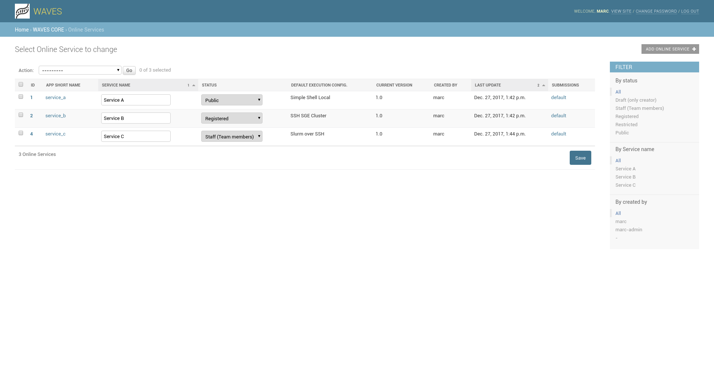

.. _service-admin-label:

Services Administration
=======================

How to configure a service in WAVES application

Service List
------------
 This is landing page when you click on 'Services' Links in Admin home page, you can see current list of services
 registered on your platform

Click on **+ Add Service** to create a new service

Service Creation
----------------

1. General options
    Here you can set general information about you service:

    - *Category* : The associated Category
    - *Service Name* : Service name
    - *Runner configuration* : Runner Adaptor setup (select box from Runner Administration :ref:`runner-admin-label`.)
    - *Descriptions* : Description and short description
    - *Version* : Current version

    .. figure:: backoffice/service-general.png
        :width: 90%
        :align: center

2. Detailed options
    Detailed options presents other details about your service:

    - *Api name* : Currently defined api_name
    - *Created By* : Current Service Owner, if you are not 'superuser', you can't change this value
    - *Access restriction* : When service online status is 'restricted', along with all staff members, you can grant other 'web user' access to your service
    - *Mail Notification* : Check or uncheck mail notification for this Service (this is disabled if configuration disallow it globally)
    - *Api availability* : Set whether service is available on api as well as on the web
    - *Command Class* : Parser Class : dedicated for specific and very complex command, set the :ref:`waves.core.commands` class implementation to create a job command line
    - *TimeRecord* : Creation and last update date, you can't set these values, they are assigned automatically

    .. CAUTION::
        Modify *api_name* attribute when service is online can produce strange side effect (particularly for your api clients)

    .. figure:: backoffice/service-detail.png
        :width: 90%
        :align: center

3. Runner Adaptor configuration
    Specifically for each Adaptor configured in WAVES, some parameters need to be setup for your 'Runs' configuration.

    - *Parameters* : Parameter list is fixed, you must set all values needed if no default is provided.
    - *Import From Runner* : If currently defined Run configuration allow direct import (such as GalaxyRunner), you may import your tools from it with 'Import From Runner' button, in right top corner

    .. CAUTION::
        These configuration fields are only available when you first save your Service, where you have setup a Runner (see General Options)

    .. figure:: backoffice/service-runner.png
        :width: 90%
        :align: center
