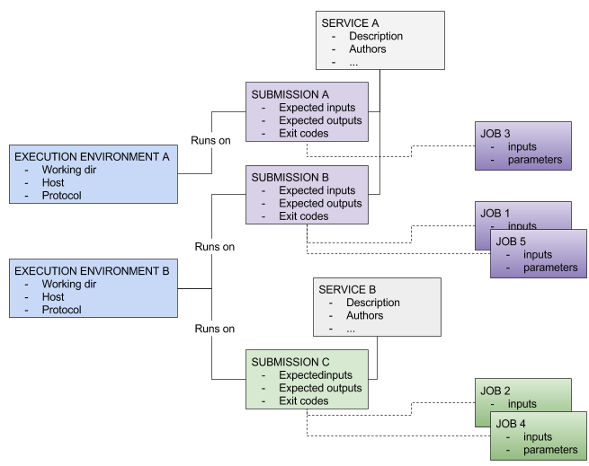
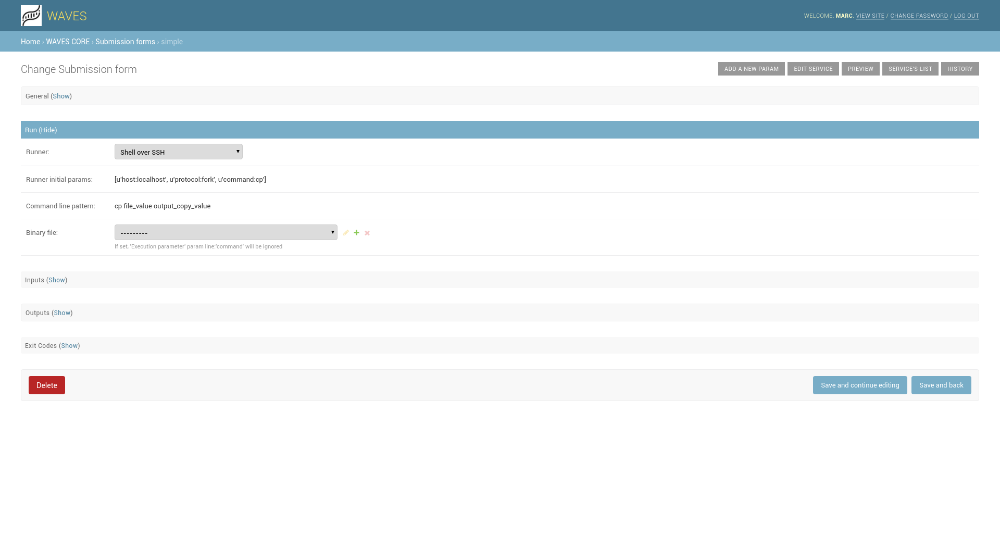
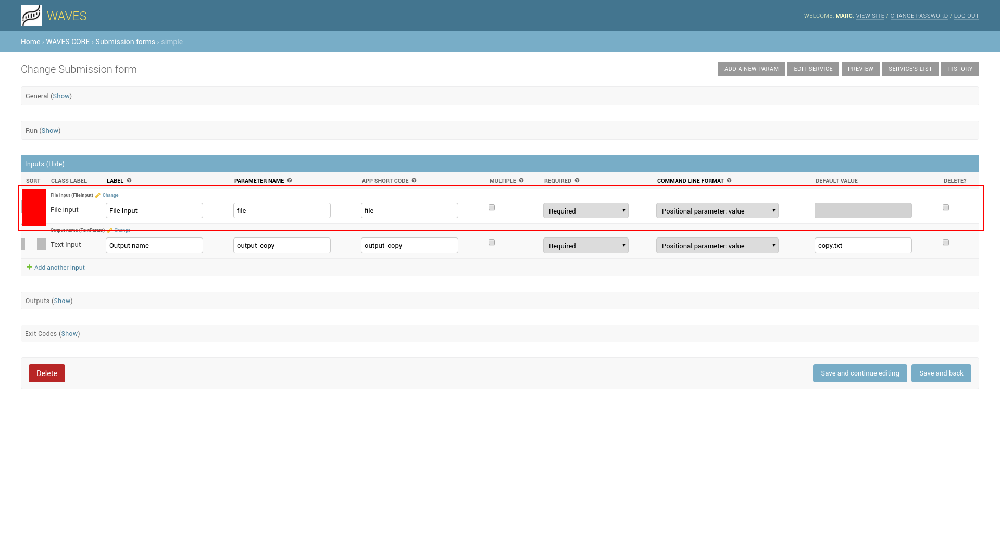

.. _service-submission-label:

==================================
Submission administration
==================================

Many bioinformatic tools provide several distinct usages. For instance, a program can be run using the command-line
interface or by providing a configuration file. Otherwise, the same tool can be run on different computing
infrastructures.

A submission is therefore the combination of a usage and a computing infrastructure.

Thus, a service can rely on different submissions.

Access submission
=================

Waves offers submission administration via direct links found across back-office

From the Services list
----------------------

    .. figure:: backoffice/service-submission.png
        :width: 90%
        :align: center
        :figclass: thumbnail

    Each service item provide direct link to related submission defined for each service

From the Service details page
-----------------------------

    .. figure:: backoffice/service-submission-2.png
        :width: 90%
        :align: center
        :figclass: thumbnail

    Here you can manage some parameters directly, or create a new submission for service.

    .. note::
        When creating a new submission, you must first click 'Add another Submission form', fill the label field, and click on
        "Save and continue editing". After this operation, you can access submission detail page with the 'change' link provided in list.

    .. note::
        You can still list all submissions, from the main menu for the WAVES app admin main page.

        .. figure:: backoffice/submission-list.png
            :width: 50%
            :align: center
            :figclass: thumbnail

Submission details
==================

For each services, you can setup multiple ways to submit a job, for example if your service may have a 'standard'
inputs list, and some 'experts' one for another type of jobs. Inputs in each submission configuration are not
necessarily correlated.

For each 'Submission configuration', you can add, remove, order possible inputs.

General information
-------------------

Some information are displayed, more for information than for modification, but you can set up related service, label, availability (API related)
and app short code (depending on your profile).

.. figure:: backoffice/submission-general.png
    :width: 50%
    :align: center
    :figclass: thumbnail

.. warning::
    * Changing related service can have strange side effect, but could be useful sometime. Use it carefully.
    * Changing app short code change the final API uri for this submission. Once online, it could break your rest client.

Run configuration
-----------------

**General Use case**

Most of the time, a service needs only one submission method, defined to run jobs on one single execution environment.
Once configured, service jobs submitted by users are sent to the execution environment with specified run parameters and user inputs.
The job is then monitored during its execution to check for its different status, once job finish its execution,
WAVES system retrieve results and store them on the platform to be made available online (HTML page or REST api entries).

Sometime, administrators want to run one submission on different calculation devices, of with different default parameters,
WAVES allows then to create more than one submission for a single service with different configuration available

If you do so, after a save, you can access run configuration for this submission, exactly as seen in service :ref:`execution configuration <service-exec-config-label>`

Submission Inputs
=================

The submission input panel show all registered inputs.

You can modify some information on existing params directly in list. You can sort inputs by drag / drop on the left side.

Service input creation
----------------------

    Click on 'Add another input' to create a new input, it opens then a popup window to setup your new input

    In this first popup, you must choose type for your new submission input

     .. figure:: backoffice/submission-params-2.png
        :width: 90%
        :align: center
        :figclass: thumbnail

    When type is selected, you enter the details information for your input. All inputs share the following information.

    * **Label**: displayed label for your input
    * **Name**: the actual parameter name used in command line for job submission
    * **Command line format**: to generate expected command line, you set here the parameter type:

        * *Assigned named parameter*: [name]=value
        * *Named short parameter*: -[name] value
        * *Named assigned long parameter*: --[name]=value
        * *Named short option*: -[name]
        * *Named long option*: --[name]
        * *Positional parameter*: value
        * *Not used in command line*: to set up a condition for other parameters, but not used in job command line

    * **Required**: Set whether submission input is mandatory, optional, or not set by service user
    * **Help Text**: Displayed on form to help user to set values
    * **Multiple**: Set whether this input may hold multiple values (for exemple, multiple files inputs)
    * **App short code**: Set input short code for api submission (set up automatically if not filled)
    * **Default value**: The default value for this input

    Some other fields are displayed depending on input type.

Text input
----------------------

* **Max Length**: Set up max length allowed for this text input

    .. figure:: backoffice/submission-params-3.png
        :width: 40%
        :align: center
        :figclass: thumbnail

File input
----------------------

* **Allowed copy paste**: Allow or not display in form of a Text field for copy/paste content added to upload file input
* **Allowed file size**: max allowed size for file input
* **Edam format(s)**: Input file EDAM ontology format
* **Edam data(s)**: Input fil EDAM ontology data type
* **Validation Regexp**: For expert, set up a RegExp for validating file input names

File input add another section where administrator can setup file sample that can be used in submission, each Sample defines:

* **Label**: A displayed label
* **Sample file**: upload here sample file

    .. figure:: backoffice/submission-params-4.png
        :width: 40%
        :align: center
        :figclass: thumbnail

Boolean input
----------------------

* **True value**: Used value when boolean is set to True, default is... True
* **False value**: Used value when boolean is set to False, default is... False

    .. figure:: backoffice/submission-params-5.png
        :width: 40%
        :align: center
        :figclass: thumbnail

Decimal parameter/Integer parameter
-----------------------------------

* **Min value**: Set up min value expected for this input
* **Max value**: Set up max value expected for this input
* **Step**: For HTML5 navigator, set up step when using number input controls up and down

    .. figure:: backoffice/submission-params-6.png
        :width: 40%
        :align: center
        :figclass: thumbnail

List parameter
--------------

* **List display mode**: Set is list is displayed as a select box (default), check boxes, or radio buttons
* **Elements**: Field where to specify list labels and values. One element per line, separated with | special caracter

    .. figure:: backoffice/submission-params-7.png
        :width: 40%
        :align: center
        :figclass: thumbnail

Inputs dependencies
-------------------

    Sometime, your services may setup dependencies between inputs, for exemple, if you setup a service which use
    DNA or Protein substitution models, you may want to change these models upon selection of type of data.

    So, to help you, WAVES allows to add "Related input" to a service input (down Service Input form part), where
    you can set exactly the same values as for a normal input, **plus** :

    - *When condition* : Activation value (from 'parent' Input), if parent is a list, correspond to selected value

    .. ATTENTION::

        Related inputs can't be 'mandatory', because their submission is dependent on another one which is potentially not set

Submission Outputs
==================

Along with your service inputs, you setup all expected outputs for each submission's job.

A service output is defined by:

* **Label** : The displayed name for your output
* **File Name or Pattern** : output file name, may contains a '%s' pattern referencing associated input value for creating file name
* **Extension** : Expected file output extension
* **App short code**: Set output short code for api output retrieval (automatically set if not filled)
* **Edam format**: Output EDAM ontology format
* **Edam data**: Output EDAM ontology data type
* **From Input** : script uses some inputs values to setup outputs file names, set corresponding input here
* **Help Text** : Associated text to output, may be displayed on job result page

    .. figure:: backoffice/submission-output.png
        :width: 90%
        :align: center
        :figclass: thumbnail

Submission ExitCode
===================

WAVES defines automatically the two exit codes "0" for normal process exit code, "1" for process error.

This is used in job run processing to declare a job as eventually successful or not

WAVEs allow you to define more exit codes as needed by your script.

Here you can define:

    * **Exit Code Value**: expected exit code, should be an int value
    * **Message**: Exit code associated message, may be used on job result page.
    * **Is and error**: Set whether job is marked as ERROR if exit code is meet

    .. figure:: backoffice/submission-exitcode.png
        :width: 90%
        :align: center
        :figclass: thumbnail

