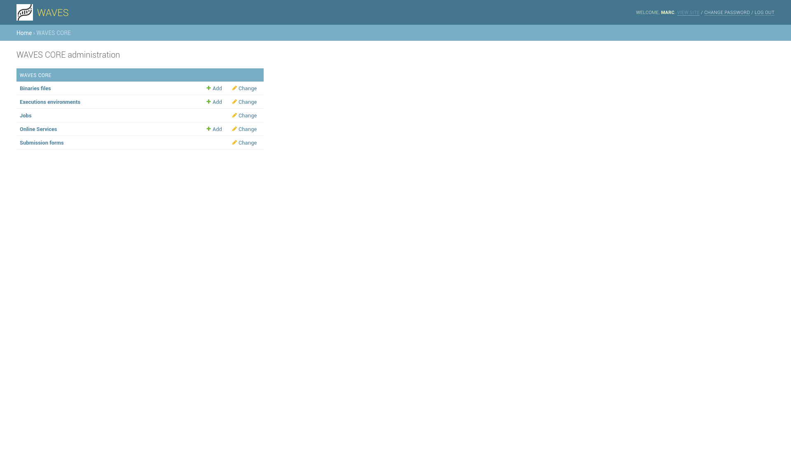

User Guide
==========

You may need a little help with 'how to configure my first service', find it here !

First get to your django backoffice and go to WAVES admin

.. toctree::
   :maxdepth: 2

   runner/runners
   service/services
   service/submissions
   job/jobs
